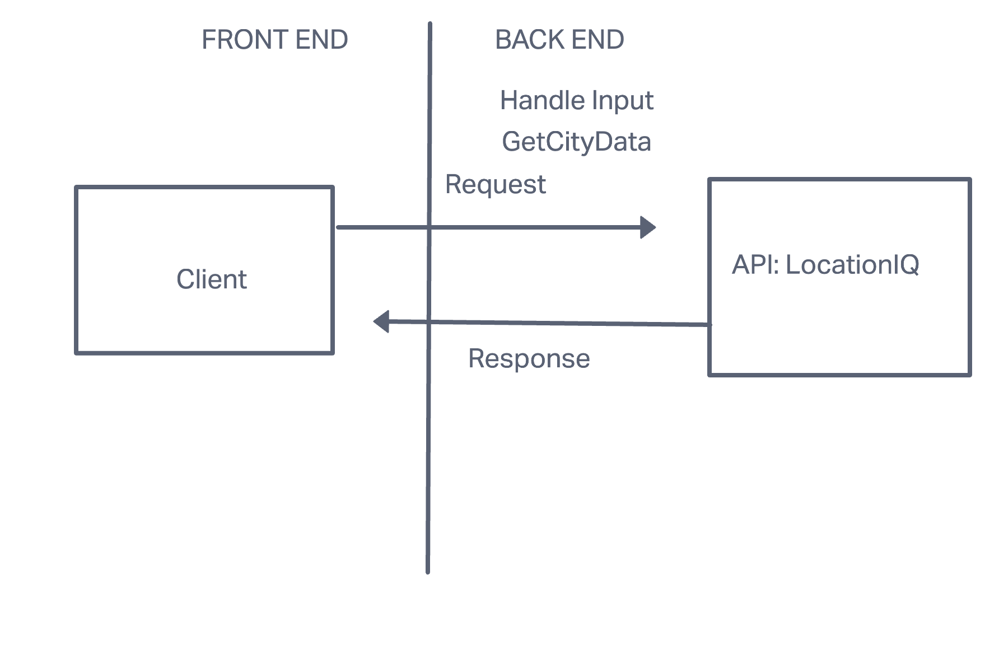
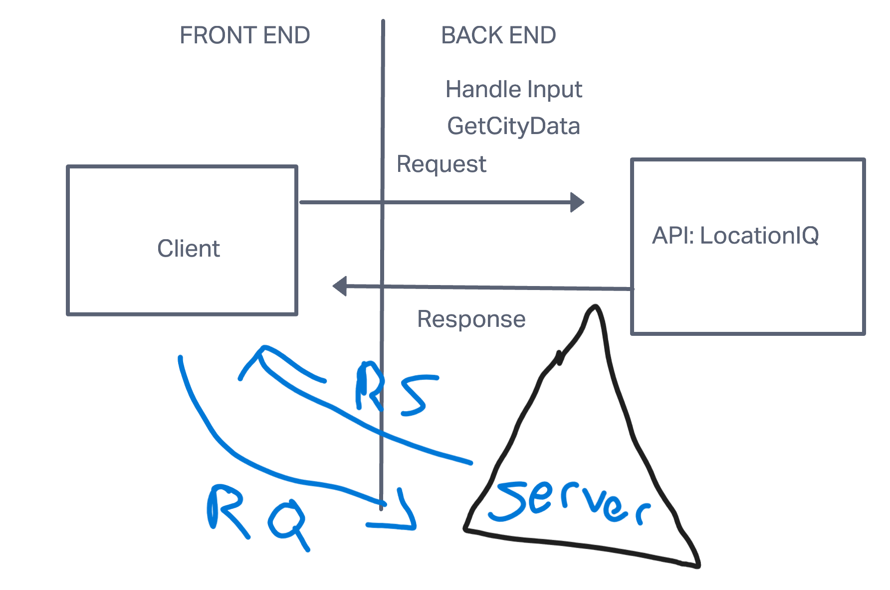
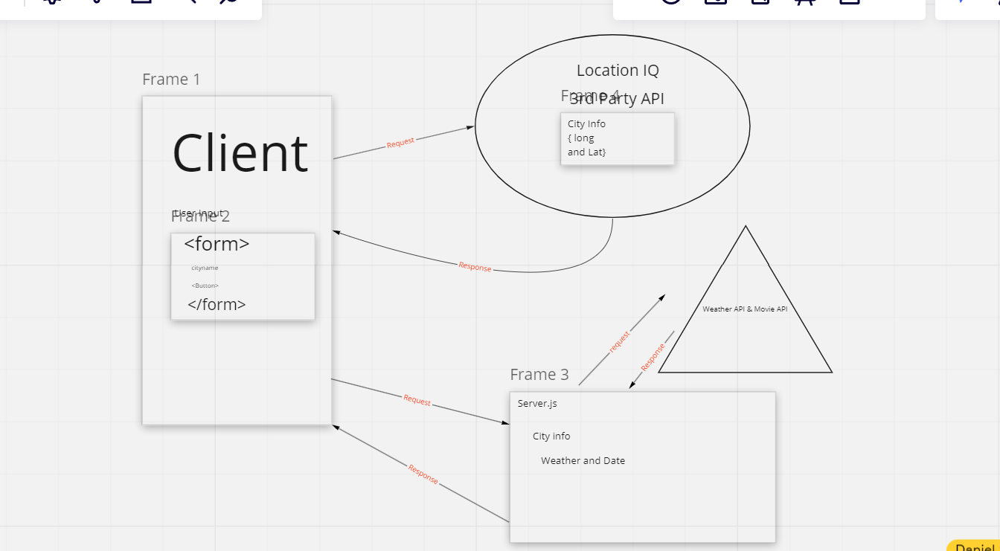
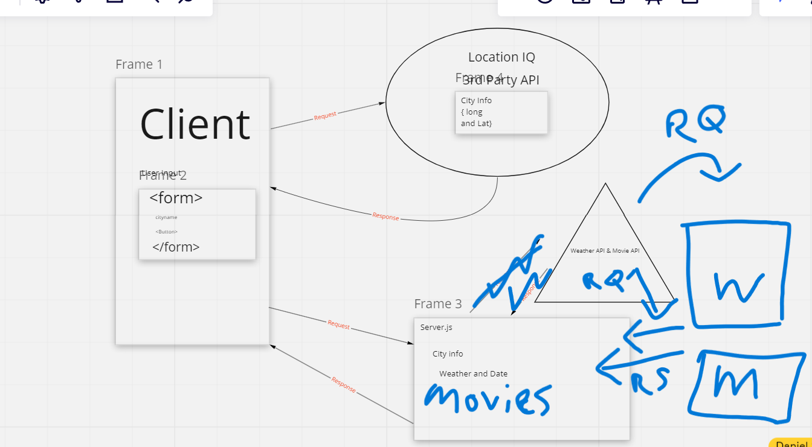

# Project Name

**Author**: Jacob Dang
**Version**: 1.0.0 (increment the patch/fix version number if you make more commits past your first submission)

## Overview
<!-- Provide a high level overview of what this application is and why you are building it, beyond the fact that it's an assignment for this class. (i.e. What's your problem domain?) --> This application is designed to geo-locate an input from a user and be able to filter inputs according to the user. As of the inital portion (Lab 6), I will be implementing APIs and LocationIQs into this in order to have a functioning app that pulls from external resources.

## Getting Started
<!-- What are the steps that a user must take in order to build this app on their own machine and get it running? --> The first steps in creating this application would be setting up the exports of API and LocationIQs and your own Access Token. These are necessary resources that your app will draw from.

## Architecture
<!-- Provide a detailed description of the application design. What technologies (languages, libraries, etc) you're using, and any other relevant design information. --> Technologies would include Javascript, React, Bootstrap, APIs, LocationIQ, CSS and/or SCSS

## Change Log
<!-- Use this area to document the iterative changes made to your application as each feature is successfully implemented. Use time stamps. Here's an example:

01-01-2001 4:59pm - Application now has a fully-functional express server, with a GET route for the location resource. -->
08-22-2022 5:30pm - Application has been launched with minimal additions

## Credit and Collaborations
<!-- Give credit (and a link) to other people or resources that helped you build this application. Stephen Clemmer, helped with request-response cycle --> Credit to Stephen Clemmer, helped with request-response cycle Diagram

## Name of feature: Lab 6
## Estimate of time needed to complete: 3 hours

## Start time: 5pm

## Finish time: 7pm

## Actual time needed to complete: 2 hours

## Name of feature: Lab 7
## Estimate of time needed to complete: 1 hour

## Start time: 2pm

## Finish time: 5pm

## Actual time needed to complete: 3 hours

## Name of feature: Lab 8
## Estimate of time needed to complete: 3 hours

## Start time: 4pm

## Finish time: 6pm

## Actual time needed to complete: 2 hours

## Name of feature: Lab 9
## Estimate of time needed to complete: 1 hour

## Start time: 2pm

## Finish time: 3pm

## Actual time needed to complete: 1 hour
